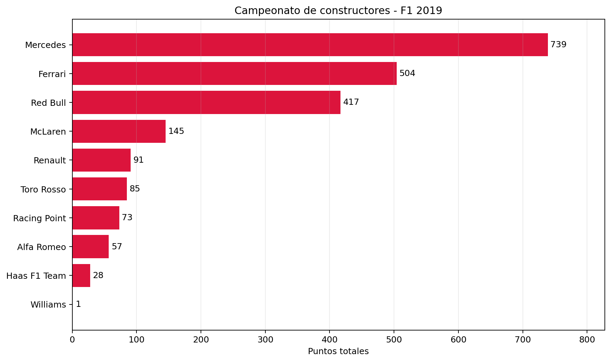

# F1 Performance Explorer

**Análisis exploratorio del rendimiento en Fórmula 1 — temporada 2019**

Primera versión terminada. Proyecto individual de análisis de datos con Python, NumPy, Pandas, Matplotlib y Jupyter Notebook.

## Resumen

Analicé 420 resultados de 21 Grandes Premios de Fórmula 1 para comparar el desempeño de pilotos y constructores durante 2019. Preparé y uní seis tablas, validé su integridad y construí métricas de puntos, recuperación de posiciones y llegadas clasificadas. Presenté los resultados mediante gráficos y conclusiones que explican tanto los hallazgos como los límites de las métricas.

**Tecnologías:** Python · NumPy · Pandas · Matplotlib · Jupyter Notebook

**Enlace al proyecto:** [Ver análisis y código en GitHub](https://github.com/Marcos1750/f1-performance-explorer)

## Objetivo

Identificar qué pilotos y escuderías rindieron mejor durante la temporada 2019 y cuáles terminaron por delante o por detrás de su posición de largada.

## Mi aporte

- Exploré seis tablas y documenté qué representa cada registro, sus claves y sus relaciones.
- Conservé los datos originales, reconocí valores faltantes y preparé los tipos de datos para el análisis.
- Uní las tablas mediante sus identificadores y comprobé que las uniones conservaran los registros y encontraran sus correspondencias.
- Definí las métricas y separé los resultados que no permitían comparar la largada con la llegada.
- Construí resúmenes por piloto, constructor y carrera, junto con cuatro gráficos y conclusiones.
- Organicé un notebook reproducible y documenté la fuente de los datos y los pasos para ejecutarlo.

## Resultados destacados

- **Puntos y recuperación:** Stroll lideró la recuperación promedio con 3,37 posiciones por carrera comparable, pero obtuvo 21 puntos. Hamilton sumó 413. La recuperación de posiciones, por sí sola, no permite evaluar todo el desempeño.
- **Clasificación y competitividad:** Williams obtuvo un 90,5 % de llegadas clasificadas, pero sumó solo 1 punto. Una llegada clasificada no garantiza puntos ni una posición competitiva.
- **Límites de la comparación:** Alemania tuvo la mayor recuperación promedio, con 3,07 posiciones. El cálculo incluyó 14 resultados comparables y excluyó 6; no permite afirmar que hubo más adelantamientos en pista.

## Habilidades aplicadas

Limpieza y exploración de datos, uniones entre tablas, validación de integridad, agrupación y agregación, tratamiento de valores faltantes, visualización, interpretación de métricas y documentación reproducible.

## Alcance y límites

El análisis utiliza los resultados finales de los Grandes Premios de 2019. La recuperación se calcula como posición de largada menos posición final y excluye los casos no comparables. No identifica cada movimiento durante la carrera ni sus causas. El proyecto no incluye telemetría, datos por vuelta ni modelos predictivos.

## Explorar el análisis

- [README con gráficos y hallazgos](README.md)
- [Notebook completo](notebooks/f1_performance_explorer.ipynb)
- [Gráfico de pilotos](figures/pilotos_puntos_2019.png)
- [Gráfico de constructores](figures/constructores_puntos_2019.png)
- [Gráfico de recuperación por carrera](figures/carreras_recuperacion_2019.png)
- [Fuente y versión de los datos](data/raw/SOURCE.md)
