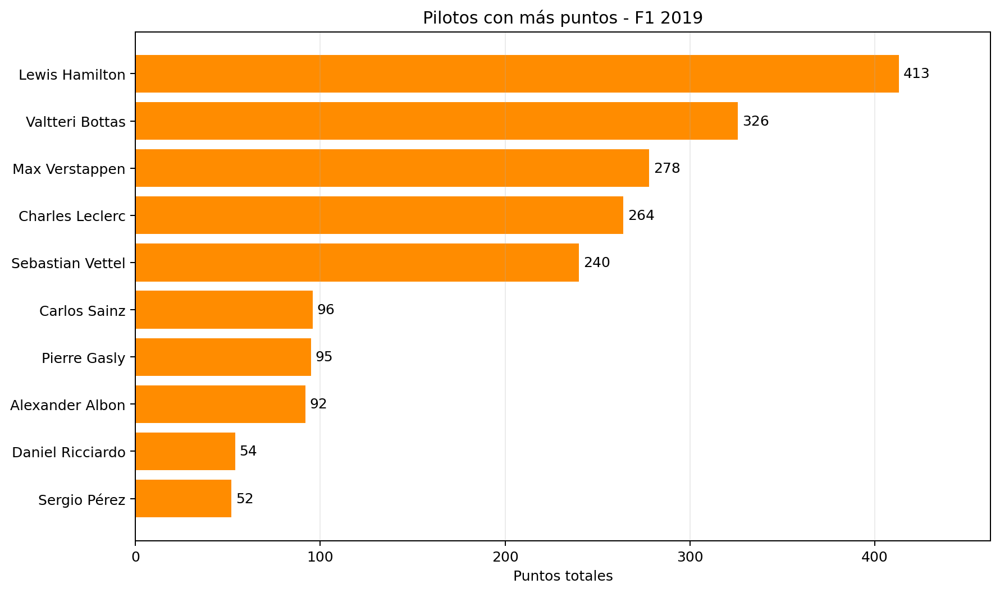
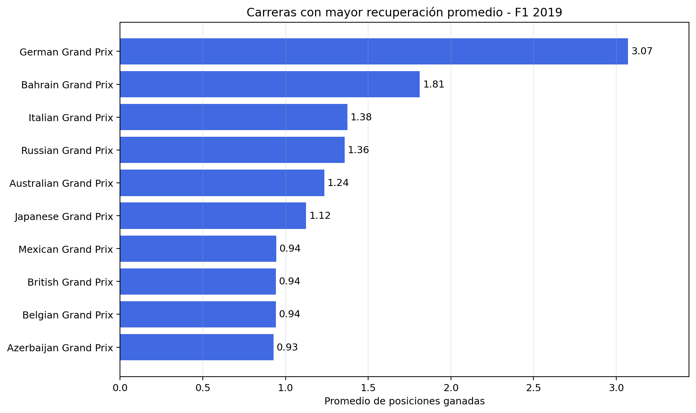

# F1 Performance Explorer

Análisis reproducible de la temporada 2019 de Fórmula 1 con NumPy, Pandas y Matplotlib.

**Primera versión terminada · 21 Grandes Premios · 20 pilotos · 420 resultados**

[Ver el análisis completo](notebooks/f1_performance_explorer.ipynb) · [Ficha del proyecto para portfolio](PORTFOLIO.md)

## Pregunta central

¿Qué pilotos y escuderías rindieron mejor durante la temporada, y cuáles consiguieron resultados superiores o inferiores a su posición de largada?

## Alcance de la primera versión

- Temporada: **2019**.
- Unidad de análisis final: un piloto en un Gran Premio.
- Incluye únicamente resultados de los Grandes Premios.
- No incluye telemetría, vueltas, neumáticos, API, SQL, aplicaciones web ni modelos predictivos.

Se eligió 2019 porque contiene 21 Grandes Premios, no tiene carreras sprint y evita que una exclusión inicial de sprints produzca una evolución de puntos incompleta. También es una temporada histórica cerrada y estable.

## Principales hallazgos

- **Pilotos:** Lance Stroll lideró la recuperación promedio, con 3,37 posiciones por carrera comparable, pero sumó 21 puntos. Lewis Hamilton obtuvo 413 puntos, aunque su recuperación promedio fue ligeramente negativa. Recuperar más posiciones no implica necesariamente un mejor desempeño global: quienes largan más atrás tienen mayor margen para avanzar.
- **Constructores:** Mercedes ganó el campeonato con 739 puntos, seguido por Ferrari con 504. Williams obtuvo un 90,5 % de llegadas clasificadas, pero sumó solo 1 punto. Una alta proporción de llegadas clasificadas no garantiza resultados competitivos; también importa la posición obtenida.
- **Carreras:** Alemania registró la mayor recuperación promedio de posiciones, con 3,07, frente a 1,81 de Bahréin. El promedio de Alemania se calculó sobre 14 resultados comparables y excluyó 6, por lo que no representa a todos los participantes ni permite afirmar que fue la carrera con más adelantamientos en pista.

## Resultados visuales

### Pilotos con más puntos



Hamilton terminó con una ventaja de 87 puntos sobre Bottas. Los puntos y la recuperación de posiciones describen aspectos diferentes del rendimiento.

### Campeonato de constructores


Mercedes aventajó a Ferrari por 235 puntos. El contraste con Williams muestra que obtener una llegada clasificada no equivale a sumar puntos.

### Carreras con mayor recuperación promedio



El promedio incluye únicamente resultados con una comparación válida entre largada y llegada. Representa una recuperación neta de posiciones, no una cantidad de adelantamientos en pista.

## Interpretación de las métricas

La recuperación de posiciones se calcula como **posición de largada − posición final**, únicamente cuando la posición de largada es mayor que cero y existe una posición final disponible. Un valor positivo indica una ganancia neta de posiciones; uno negativo, una pérdida neta; y cero indica que el piloto terminó en la misma posición desde la que largó.

Esta diferencia no cuenta los adelantamientos en pista ni identifica sus causas. También puede reflejar abandonos de otros pilotos, estrategias o sanciones. Los casos no comparables se mantienen como valores faltantes y se excluyen del promedio de recuperación.

El porcentaje de llegadas clasificadas representa la proporción de resultados con una posición final disponible. No equivale al porcentaje de carreras con puntos ni demuestra, por sí solo, que un piloto o constructor haya sido competitivo.

## Estructura

```text
f1-performance-explorer/
├── data/
│   ├── raw/          # CSV originales: no se editan
│   └── processed/    # salidas creadas por el notebook
├── figures/          # gráficos exportados
├── notebooks/
│   └── f1_performance_explorer.ipynb
├── PORTFOLIO.md      # ficha del proyecto para presentación
├── README.md
└── requirements.txt
```

Los datos crudos y su versión exacta están documentados en `data/raw/SOURCE.md`.

## Puesta en marcha

Desde esta carpeta:

```powershell
py -m venv .venv
.venv\Scripts\python -m pip install -r requirements.txt
.venv\Scripts\python -m jupyter lab
```

Abrí `notebooks/f1_performance_explorer.ipynb` y ejecutá las celdas en orden.

La ejecución completa también vuelve a generar las tres imágenes mostradas en este README dentro de `figures/`. El notebook incluye un cuarto gráfico con la evolución de puntos de los tres constructores líderes.

## Continuar desde otra computadora

En la otra computadora, iniciá sesión en GitHub con la cuenta que tiene acceso al repositorio. Después, desde la carpeta donde quieras guardar el proyecto:

```powershell
git clone https://github.com/Marcos1750/f1-performance-explorer.git
cd f1-performance-explorer
py -m venv .venv
.venv\Scripts\python -m pip install -r requirements.txt
.venv\Scripts\python -m jupyter lab
```

El entorno `.venv` se crea en cada computadora y no se sube a GitHub. Los CSV originales y el notebook sí están en el repositorio. Ejecutá el notebook desde el principio después de clonarlo para reconstruir las variables de Python.

Para llevar los cambios de una computadora a la otra, guardá el notebook y, en la primera, ejecutá:

```powershell
git status
git add notebooks/f1_performance_explorer.ipynb
git commit -m "Actualizar análisis"
git push
```

En la segunda, ejecutá `git pull` antes de seguir trabajando. Evitá editar el mismo notebook en ambas computadoras sin sincronizar entre medio.

